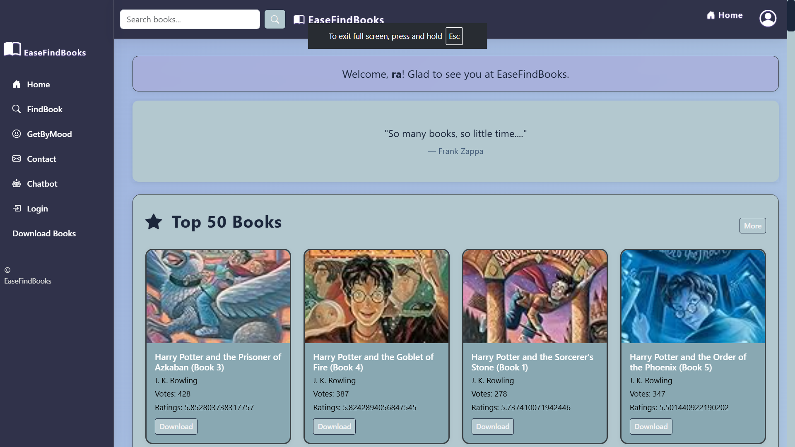
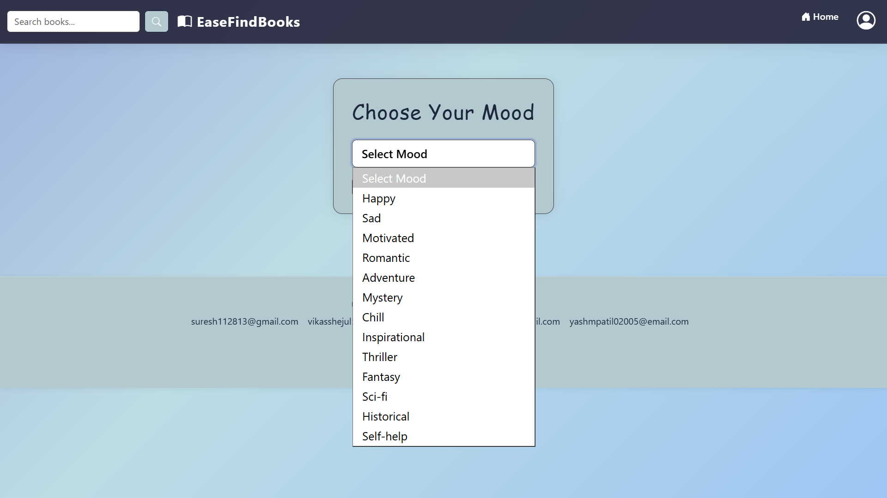
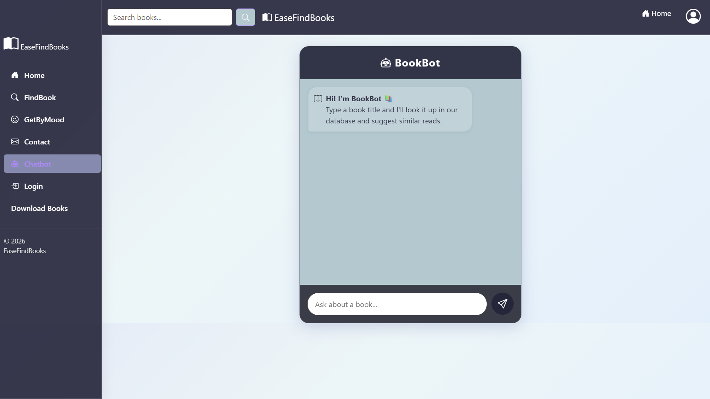
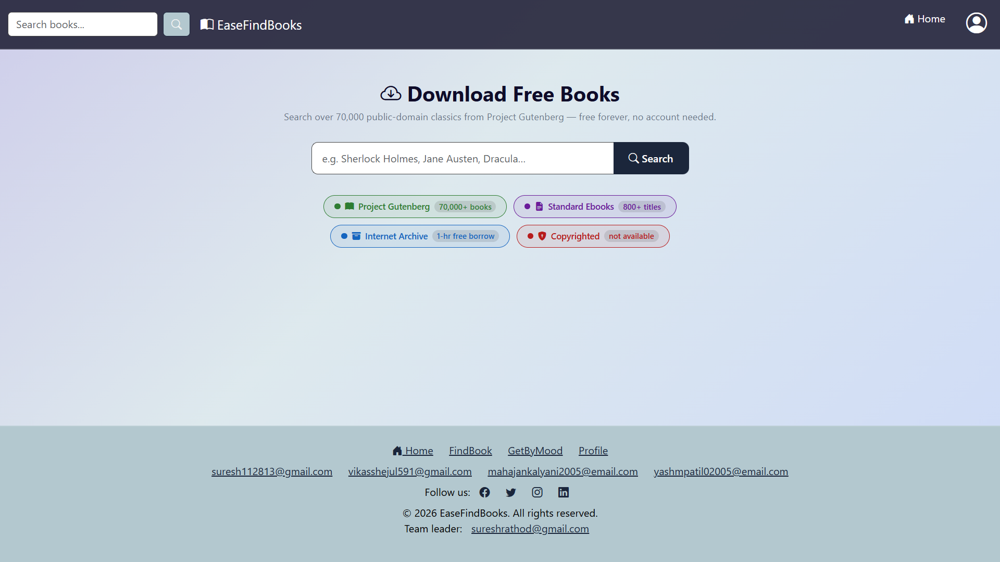

# 📚 EasyFindBooks

A simple web application that helps users discover books through personalized recommendations, search books, and manage their reading profile.

## 🌐 Live Demo

**Website:** https://YashPatil2026.pythonanywhere.com

---

## ✨ Features

* 🔐 User Login & Registration
* 📖 Personalized Book Recommendations
* 🔍 Search Books
* 💬 Chatbot Support
* 👤 User Profile
* 📱 Responsive User Interface

---

## 🖼️ Project Screenshots

### Home Page



### Get By Mood



### Book Recommendation


### Bookbot



### Download Books



---

## 🛠️ Tech Stack

* Python
* Flask
* HTML
* CSS
* JavaScript
* SQLite
* Pandas
* NumPy

---

## 📂 Project Structure

```text
EasyFindBooks/
│
├── app.py
├── requirements.txt
├── artifacts/
├── model/
├── routes/
├── static/
├── templates/
├── screenshots/
└── README.md
```

---

## 📌 Future Improvements

* ⭐ Book Ratings & Reviews
* ❤️ Wishlist
* 📚 Reading History
* 📧 Email Verification
* 🤖 Smarter AI Recommendations

---

## 👨‍💻 Author

**Yash Patil**

GitHub: https://github.com/Yash-Patil-26
