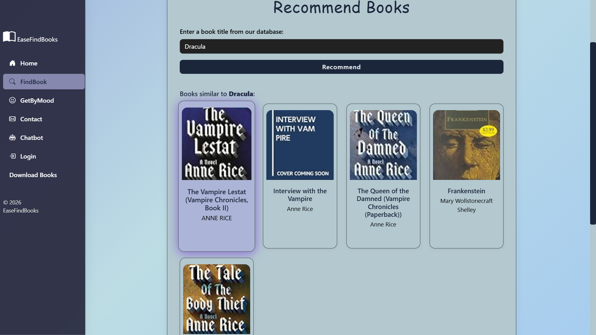
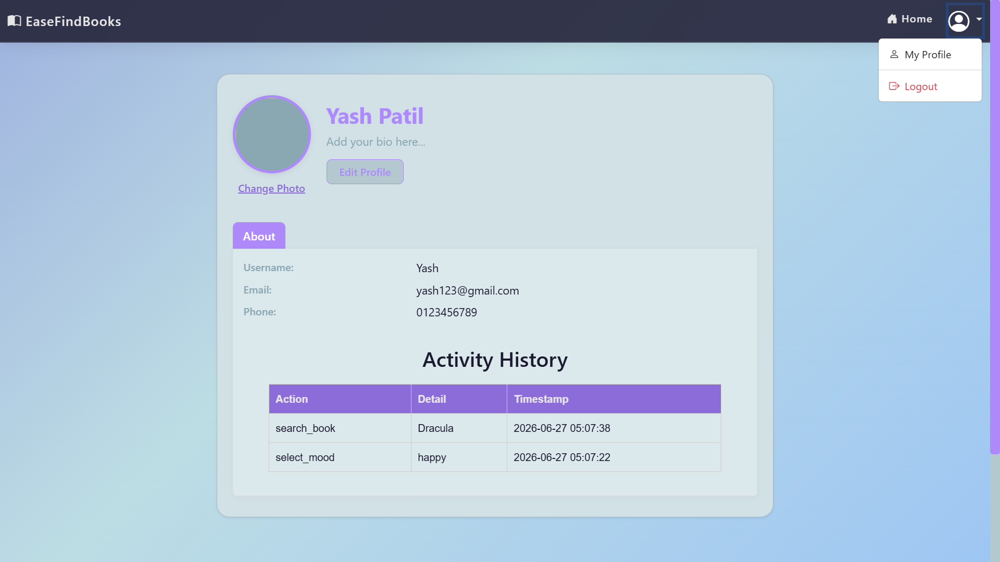

<div align="center">

# 📚 EasyFindBooks

**Book discovery platform powered by collaborative filtering — finds books based on what readers like you enjoy.**


[](https://python.org)
[](https://flask.palletsprojects.com)
[](https://getbootstrap.com)
[](https://sqlite.org)
[](https://yashpatil2026.pythonanywhere.com)
[](LICENSE)

🌐 **[yashpatil2026.pythonanywhere.com](https://yashpatil2026.pythonanywhere.com)**

</div>

---

## 📸 Screenshots

| FindBook | GetByMood |
|:---:|:---:|
|  |  |

| BookBot | Download | Profile |
|:---:|:---:|:---:|
|  |  |  |

---

## ✨ Features

- 🔐 **User Auth** — Signup, login, profile photo upload, search history
- 📖 **FindBook** — Search from 742 books, get 5 ML-powered recommendations instantly
- 🎭 **GetByMood** — Pick a mood (Happy, Fantasy, Thriller, Sci-Fi, Chill, etc.) and browse curated lists
- 🤖 **BookBot** — Chat assistant: search a title, get cover, author, year & similar reads
- 📥 **Download Books** — Search 70,000+ free classics via Project Gutenberg (EPUB, Kindle, Text)
- 📱 **Responsive UI** — Works on desktop and mobile

---

## 🧠 How Recommendations Work

Uses **collaborative filtering** — not genre tags, but real user behaviour. A 742 × 810 pivot table stores book ratings from real users. Pre-computed cosine similarity scores find books whose readers overlap most with your searched book.

```
Search "1984"  →  finds users who rated it  →  finds what else they loved
→  Brave New World · Foundation · Never Let Me Go · Fahrenheit 451
```

---

## 🛠️ Tech Stack

| Layer | Technologies |
|---|---|
| Backend | Python 3.10, Flask 3.0, SQLite, SQLAlchemy |
| ML Engine | NumPy, Pandas, scikit-learn (cosine similarity) |
| Frontend | Bootstrap 5.3, Bootstrap Icons, Vanilla JS, Jinja2 |
| Data | Book-Crossings Dataset (1.1M ratings), Project Gutenberg OPDS API |
| Hosting | PythonAnywhere (free tier) |

---

## 📂 Project Structure

```
EasyFindBooks/
│
├── app.py                    ← All routes + recommendation logic
├── requirements.txt
├── .gitignore
│
├── model/user.py             ← SQLAlchemy models
├── routes/auth.py            ← Auth blueprint
├── static/                   ← Background image, profile photos
├── screenshots/              ← Project screenshots
│   ├── home.png
│   ├── recommend.png
│   ├── mood.png
│   ├── bookbot.png
│   ├── download.png
│   └── profile.png
│
└── templates/
    ├── *.html                ← All page templates
    ├── pt.pkl                ← Pivot table: 742 books × 810 users
    ├── books.pkl             ← Book metadata (title, author, cover)
    ├── similarity_scores.pkl ← Pre-computed 742×742 similarity matrix
    ├── popular.pkl           ← Top 50 books for home page
    └── download_map.json     ← Free download URLs for 139 books
```

---

## 🚀 Getting Started

```bash
# 1. Clone
git clone https://github.com/Yash-Patil-26/EasyFindBooks.git
cd EasyFindBooks

# 2. Install dependencies
pip install -r requirements.txt

# 3. Run
python app.py
```

Open `http://127.0.0.1:5000` — the database is created automatically on first run.

---

## 🔮 Future Improvements

- [ ] Book ratings & reviews
- [ ] Wishlist / reading list
- [ ] Email verification
- [ ] Real-time model retraining as users rate books
- [ ] Reading statistics dashboard

---

## 👥 Team

| Name | Role | Email |
|---|---|---|
| **Suresh Rathod** | Team Leader | suresh112813@gmail.com |
| **Yash Patil** | Developer | yashmpatil02005@email.com |
| **Vikas Shejul** | Developer | vikasshejul591@gmail.com |
| **Kalyani Mahajan** | Developer | mahajankalyani2005@email.com |

---

## 🙏 Acknowledgements

- [Book-Crossings Dataset](http://www2.informatik.uni-freiburg.de/~cziegler/BX/) — Cai-Nicolas Ziegler, University of Freiburg
- [Project Gutenberg](https://www.gutenberg.org/) — Free public-domain book library
- [Bootstrap](https://getbootstrap.com/) & [Bootstrap Icons](https://icons.getbootstrap.com/)

---

<div align="center">
Made with ❤️ by Team EasyFindBooks &nbsp;·&nbsp; First Year Engineering Project &nbsp;·&nbsp; 2025–26
</div>
